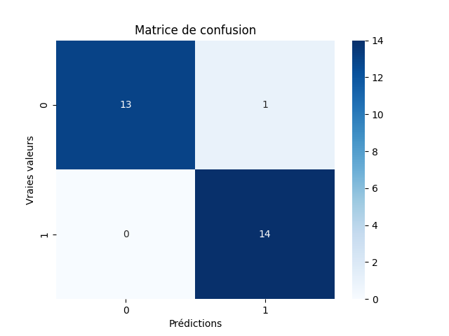
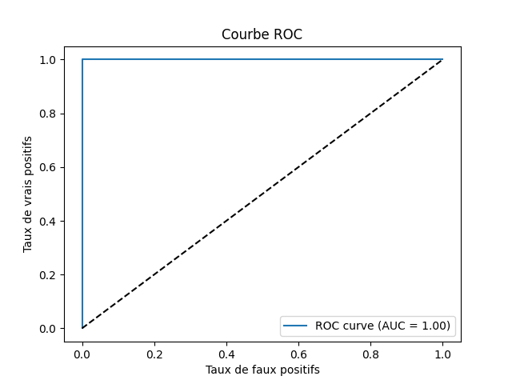

# CAPTCHAT 🐱

## Description

CAPTCHAT 🐱 est une application web conçue pour collecter et analyser les mouvements de souris des utilisateurs afin de déterminer s'ils sont effectués par un humain ou un robot. Le projet utilise un serveur Flask pour le backend en Python et une page web en HTML et JavaScript pour le frontend. Les données collectées sont utilisées pour extraire des indicateurs pertinents, puis un modèle de machine learning (Random Forest) est entraîné pour classifier les mouvements.
</br></br>Ce projet est très largement inspiré de reCAPTCHA de Google.


## Fonctionnalités

- Collecte des mouvements de souris et des clics sur une page web.
- Enregistrement des données dans un fichier CSV pour une analyse ultérieure.
- Extraction d'indicateurs à partir des données collectées.
- Entraînement d'un modèle de machine learning pour classer les mouvements en 'humain' ou 'machine'.
- Interface web interactive pour démarrer et arrêter la collecte des données.

## Résultats de l'entrainement #1 [Random Forest]
### Dataset:
- 35 mouvements ligne droite (robot)
- 35 mouvements courbe de bézier (robot)
- 70 mouvements naturels variés (humains)

</br>

### Matrice de confusion :
</br>

### Courbe ROC :
</br>


## Prérequis

- Python 3.x
- Navigateur web moderne (Chrome, Firefox, etc.)


## Bibliothèques Python requises

- Flask
- pandas
- numpy
- scikit-learn
- seaborn
- matplotlib
- scipy


# Installation
1. Cloner le dépôt ou télécharger les fichiers du projet

```bash
git clone https://github.com/GregoireSauvage/CAPTCHAT.git
cd CAPTCHAT
```

2. Créer un environnement virtuel (recommandé)

```bash
python -m venv venv
```

3. Activer l'environnement virtuel

    Sur Windows:

    ```bash
    venv\Scripts\activate
    ```

    Sur macOS/Linux:

    ```bash
    source venv/bin/activate
    ```

4. Installer les dépendances

```bash
pip install -r requirements.txt
```

## Structure du projet

- app.py: Fichier principal contenant le serveur Flask et les routes pour la collecte, l'extraction des indicateurs et l'entraînement du modèle.
- templates/BotDetector.html: Page HTML pour la collecte des mouvements de souris.
- get_indicators.py: Contient les fonctions pour extraire les indicateurs des mouvements de souris.
- organize_data.py: Contient les fonctions pour nettoyer et organiser le dataset.
- model.py: Contient la fonction pour entraîner le modèle Random Forest.
- mouse_data.csv: Fichier CSV où sont enregistrées les données brutes des mouvements de souris.
- mouse_indicators_dataset.csv: Fichier CSV contenant les indicateurs extraits, utilisé pour l'entraînement du modèle.
- static/: Dossier pour les fichiers statiques (si nécessaire).
- templates/: Dossier contenant les templates HTML.


## Utilisation
1. Démarrer le serveur Flask

Assurez-vous d'être dans le répertoire du projet et exécutez:

```bash
python app.py
```

Le serveur devrait démarrer sur http://localhost:5000/.


2. Collecte des données

- Ouvrez un navigateur web et accédez à http://localhost:5000/. La page affichera un bouton Vérifier.
- Déplacez la souris sur la page pendant au moins 5 secondes.
- Cliquez sur le bouton "Vérifier" pour arrêter l'enregistrement et envoyer les données au serveur.
- Les données de mouvements de souris et de clics seront enregistrées dans mouse_data.csv.

3. Extraction des indicateurs

Pour extraire les indicateurs à partir des données collectées:
- Accédez à http://localhost:5000/extract.
- Cette route exécutera la fonction get_indicators() qui extrait les indicateurs et les enregistre dans mouse_indicators_dataset.csv.

4. Entraîner le modèle

Pour entraîner le modèle de machine learning:
- Accédez à http://localhost:5000/train.
- Cette route exécutera la fonction random_forest() qui entraîne le modèle et affiche les résultats.

5. Interpréter les résultats
- Les résultats de l'entraînement, y compris les métriques de performance et l'importance des caractéristiques, seront affichés dans la console.
- Le modèle entraîné peut être sauvegardé pour une utilisation ultérieure.


